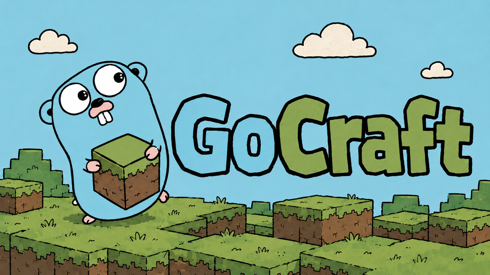

<p align="center">
  
</p>

<h1 align="center">GoCraft</h1>

<p align="center">
  A native-Go Minecraft server built from scratch around an edition-agnostic core.
</p>

> [!WARNING]
> GoCraft is early experimental software. It is **not production-ready** and should not be exposed as a public server. Expect breaking changes and data-model changes during development.

## Overview

GoCraft is a native Go implementation of a Minecraft server written from scratch. It is built around a protocol-independent game core with edition-specific network adapters at the boundary. It is not a Paper fork, does not use the JVM, and is not a drop-in replacement for an existing server.

A vanilla Minecraft: Java Edition 1.21.4 client can connect, authenticate, complete configuration, and enter a persistent seed-driven world. Players can move, chat, run slash commands, break and place blocks using items from their inventory, and see other players and passive mobs in real time. World changes are saved to Anvil region files and reloaded on restart.

## Compatibility

| Client | Current status |
| --- | --- |
| Minecraft: Java Edition 1.21.4 | Active development target |
| Java protocol 769 | Implemented |
| Other Java Edition versions | Not supported |
| Minecraft: Bedrock Edition | Planned; no adapter exists yet |

Changing `version_name` or `protocol_version` in `server.yml` changes the advertised status metadata only; it does not add protocol compatibility.

## Implemented

- Native Go entry point and executable
- TCP listener, per-connection goroutines, and graceful process shutdown
- Minecraft packet framing, VarInt/VarLong encoding, UUIDs, and common wire types
- Handshake routing to status or login state
- Server-list status response with MOTD, version, and player limits
- Ping/pong latency exchange
- Offline-mode login with deterministic offline UUIDs
- Online-mode authentication through the Mojang session server
- RSA key exchange and AES-128-CFB8 encrypted connections
- Java configuration state:
  - Known-packs negotiation via a `registry.Provider` interface (`VanillaProvider` uses the vanilla 1.21.4 shortcut; future providers can send full registry data for custom content or Bedrock translation)
  - `minecraft:brand` plugin message, vanilla feature flags, and configuration completion
- Entry into the Java play state:
  - Login, abilities, default spawn, tab-list entry, position sync, center-chunk marker
  - Teleport confirmation
  - Periodic keep-alive requests and response validation
- **Canonical world layer** (`core/world`):
  - Edition-agnostic `Block` type with `Namespace`, `Name`, and `Properties` — no Java or Bedrock IDs in the core
  - Palette-based `Section` and `Chunk` types; 24 sections per column (Y=−64 to 319)
  - Deterministic seeded terrain with oceans, mountains, cliffs, climate biomes, caves, ores, and vegetation
  - Concurrent World cache with on-demand generation and configurable background pregeneration
  - `Storage` interface with Anvil region-file implementation: NBT read/write, zlib compression, atomic `.tmp`-then-rename saves, dirty-chunk tracking, lazy load on first access
  - Architecture test that fails at compile time if any `core/` package imports `java/`
- **Java chunk encoding** (`java/world`):
  - Data-driven Java 1.21.4 global block state ID registry
  - `Block → Java state ID` lookup at the adapter boundary — the core never touches Java IDs
  - Network-NBT heightmap encoding (root compound without name, 1.20.2+ format)
  - `PalettedContainer` encoder: indirect palette, ≥4 bits/entry, no-overflow packing
  - Level Chunk With Light packets with height-aware sky-light masks and block entities
  - Center-first chunk batches, configurable view distance, unload hysteresis, and background pregeneration
- **Multiplayer** (`java/handler`):
  - Player spawn and despawn packets broadcast to all other sessions
  - Position and head-rotation broadcast on every movement packet
  - Lock-free broadcast via session snapshot (no lock held during socket writes)
- **Chat** (`java/handler`):
  - Player chat messages broadcast to all connected players
  - `/`-prefixed input treated as commands (no-op until M12)
  - 256-character message length limit with client notification
- **Block interaction** (`java/handler`):
  - Creative instant-break on START\_DIGGING; survival break on FINISH\_DIGGING
  - Block placement from the held item; occupied-block guard prevents overwriting solid blocks
  - Y-bounds validation before any world mutation
  - Block Update broadcast to all sessions; Acknowledge Block Change sequence echo
  - Container menus and processing (crafting tables, furnaces, chests) are not implemented yet; loaded block-entity NBT is preserved
- **Inventory and items** (`core/player`, `java/world`, `java/handler`):
  - `ItemStack{ItemID, Count}` in `core/player` — no Java IDs in the core
  - 46-slot player inventory with hotbar slot tracking; `HeldItem()` accessor
  - Creative Mode Set Item handling: maps numeric item registry IDs to canonical resource locations
  - Set Held Item tracking for hotbar scroll; initial inventory sent on join
- **Data-driven registries** (`internal/gamedata`, `java/world`):
  - Block state IDs, item protocol IDs, and entity-type protocol IDs loaded from JSON at init time
  - `internal/gamedata` package embeds `java/1.21.4/blocks.json` and `java/1.21.4/registries.json` via `//go:embed`; files ship inside the binary — no external data directory required at runtime
  - JSON format matches Minecraft's data-generator output (`--reports`); replace the embedded files and rebuild to update version or expand coverage
  - Property-keyed block state lookup (`"minecraft:grass_block[snowy=true]"` → ID) extracted from states arrays; key sort matches `core/world.Block.Key()` so no Java IDs leak into the core
  - Block, item, and entity-type hardcoded Go maps removed; maps populated by `registry.go` init function with structured logging of entry counts
- Protocol-independent player, spatial, and online-player registry types
- YAML configuration with defaults and validation (`world_dir` for Anvil persistence and `world_seed` for deterministic terrain)
- Structured logging through Go's `log/slog`
- Automated tests for authentication, cryptography, packet framing, VarInt encoding, and architecture isolation

- **Entity system** (`core/entity`, `java/handler`, `server/`):
  - Canonical `Entity` struct with position, velocity, health, dead flag, and concurrency ownership comment
  - `entity.Manager`: thread-safe Add / Remove / Get / Snapshot
  - ~40 `EntityType` string constants (resource location format)
  - 20 TPS tick loop in `server.Server`: gravity (−0.08 blocks/tick²), horizontal drag (0.98), flat-world ground clamp at Y=64, dead-entity cleanup, tick-drift warning (>50 ms)
  - Non-blocking broadcast: packets built synchronously inside the tick goroutine (sole writer), dispatched to a goroutine for I/O so slow clients cannot stall the simulation
  - Java entity encoding: Spawn Entity packet, Teleport Entity packet, Remove Entities packet
  - Five passive test mobs spawned near world spawn; sent to joining players via `onPlayerJoin`
  - `game.Game.NextEntityID()` shared atomic counter ensures player and mob IDs never collide
- **Command system** (`java/handler`):
  - `Dispatcher` with `Register` / `Dispatch`; unknown commands and handler errors reported to the issuing player as chat messages
  - `CommandContext` with `Player`, `Conn`, `Args`, `World`, `Manager`, and `TeleportTo` closure
  - Commands packet (brigadier DAG, 0x11 S→C) sent on join for client-side tab completion
  - `/help` — list commands; `/list` — online player names and count
  - `/gamemode <mode>` — updates canonical `Player.GameMode`, sends Game Event reason 3 + Player Abilities + tab-list update broadcast
  - `/tp <x> <y> <z>` — teleports player, sends Synchronize Player Position, immediately streams destination chunks and unloads origin chunks via `TeleportTo` closure
  - `/tp <player>` — player-name teleport with the same immediate chunk-streaming behaviour
  - `/give <item> [count]` — fills first empty hotbar/inventory slot, syncs full inventory
  - `/kick <player> [reason]` — sends Disconnect (Play) with NBT-encoded reason, closes connection

### Not implemented

Permissions, survival gameplay mechanics, and complete entity AI are not implemented. Paper plugin compatibility, Bedrock clients, and cross-play are not supported.

## Architecture

```text
                         ┌──────────────────────────┐
Java Edition client ───▶ │ Java protocol adapter    │
                         │ java/network             │
                         │ java/handler             │
                         │ java/world  ─┐           │
                         │ java/registry│           │
                         └──────────────┼───────────┘
                                        │ canonical Block / Chunk
                         ┌──────────────▼───────────┐
                         │ GoCraft core             │
                         │ core/world               │  ← no Java or Bedrock imports
                         │ core/player              │
                         │ core/game                │
                         │ core/spatial             │
                         └──────────────┬───────────┘
                                        │ canonical Block / Chunk
                         ┌──────────────▼───────────┐
Bedrock client ─ ─ ─ ─ ▶ │ Future Bedrock adapter  │
                         │ bedrock/world (planned)  │
                         └──────────────────────────┘
```

### Block identity

The canonical block type carries no edition-specific IDs:

```go
// core/world — shared by all adapters
type Block struct {
    Namespace  string            // "minecraft"
    Name       string            // "stone", "grass_block", …
    Properties map[string]string // {"snowy": "false"}, nil = default state
}
```

Edition-specific IDs are resolved entirely at the adapter boundary:

```
Canonical Block
       │
┌──────┴──────┐
▼             ▼
Java global   Bedrock runtime
state ID      ID (future)
```

This means only the encoder packages need to change when updating Java versions or adding Bedrock support; `core/` is untouched. The architecture test in `core/world/arch_test.go` enforces this by failing the build if any `core/` file imports `GoCraft/java`.

### Registry abstraction

Known-packs negotiation and registry delivery are behind a `registry.Provider` interface:

```go
type Provider interface {
    Packs() []Pack
    SendRegistries(conn *network.ClientConn) error
}
```

`VanillaProvider` uses the Known-Packs shortcut (zero registry packets for vanilla 1.21.4). A future `ExplicitProvider` will send full registry data for custom dimensions, custom biomes, additional Java versions, and Java-to-Bedrock ID translation.

- **GoCraft core (`core/`)** owns the edition-neutral game state: blocks, chunks, world, entities, players, inventories, and spatial types. It never imports `java/` or `bedrock/`.
- **Java adapter (`java/`)** reads from `core/` and produces native Java Edition packets: TCP framing, login auth, encryption, chunk encoding, and play-state management. It does not know Bedrock exists.
- **Bedrock adapter (`bedrock/`)** will read from the same `core/` and produce native Bedrock Edition packets independently: RakNet/UDP, Xbox auth, Sub Chunk format, Bedrock runtime IDs. It does not consume Java packets and is not a proxy.
- **Server layer (`server/`)** wires configuration, the core, and the active adapters into the executable.

## Development status

| Milestone | Status | Scope |
| --- | --- | --- |
| 1 — Handshake and status ping | Complete | Handshake, server-list response, ping/pong, YAML configuration |
| 2 — Login and authentication | Complete | Offline and online login, Mojang session verification, RSA and AES-CFB8 |
| 3 — Configuration and play-state entry | Complete | Known packs, feature flags, initial play packets, teleport confirmation, keep-alive |
| 4 — World layer and chunk streaming | Complete | Canonical Block/Chunk types, seeded terrain, Java chunk encoding, batched streaming and pregeneration |
| 5 — Movement and dynamic chunk streaming | Complete | Movement packet handling, posToChunk floor-division, per-boundary chunk load/unload |
| 6 — Multiplayer sync | Complete | Player spawn/despawn, position and head-rotation broadcast, lock-free session snapshot |
| 7 — Chat | Complete | Chat broadcast, `/` command prefix, 256-character length limit |
| 8 — Block interaction | Complete | Creative/survival break logic, block placement from held item, Block Update broadcast, Y-bounds guard |
| 9 — World persistence | Complete | Anvil region-file I/O, NBT read/write, atomic saves, dirty-chunk tracking, `Storage` interface |
| 10 — Inventory and items | Complete | ItemStack, 46-slot inventory, hotbar tracking, Creative Mode Set Item, placement from held item, occupied-block guard |
| 11 — Entity system | Complete | Canonical Entity type, entity registry, mob spawn/tick/despawn, health and damage, 20 TPS tick loop |
| 12 — Commands | Complete | Command dispatcher, Commands packet (tab-completion DAG), /gamemode /tp /give /kick /list /help |
| 13 — Data-driven registries | Complete | Load block state IDs, item IDs, entity-type IDs, and biome IDs from versioned JSON (`blocks.json`, `items.json`, `registries.json`); embedded via go:embed; hardcoded Go maps replaced; unknown IDs warn once via sync.Map |
| 13.1 — Data-driven packet IDs | Complete | Semantic packet names (minecraft:login etc.) in versioned JSON; internal/protocoldata MustCB/MustSB panic at startup on missing names; all handler hex constants removed; validation test suite (7 distinct invariants); GitHub Actions CI on ubuntu-latest |
| 14 — Bedrock adapter | Future work | RakNet/UDP, Xbox auth, bedrock/world encoder using M13 registries for runtime IDs, cross-play via shared core/ |
| 15 — Go plugin API | Future work | Event bus, command registration, scheduler, permission nodes; plugins are compiled Go packages |

Detailed records for completed milestones are kept in [`logs/`](logs/).

## Requirements

- [Go](https://go.dev/) 1.23 or newer, as declared by `go.mod`
- Git, when cloning the repository
- A Minecraft: Java Edition 1.21.4 client for manual connection testing
- Network access to Mojang's session service when `online_mode: true`

No Java runtime is required.

## Clone, test, and build

### Windows PowerShell

```powershell
git clone https://github.com/el211/GoCraft.git
Set-Location GoCraft
go mod download
go test ./...
go build -o gocraft.exe .
```

### Linux / macOS

```bash
git clone https://github.com/el211/GoCraft.git
cd GoCraft
go mod download
go test ./...
go build -o gocraft .
```

## Configure

GoCraft reads `server.yml` from its working directory. The repository includes:

```yaml
host: 0.0.0.0
port: 25565
motd: A GoCraft Server
max_players: 20
version_name: 1.21.4
protocol_version: 769
online_mode: false
world_dir: world
world_seed: 0
view_distance: 8
pregenerate_radius: 12
```

| Setting | Meaning |
| --- | --- |
| `host` | Address on which the Java TCP listener binds |
| `port` | Java Edition server port |
| `motd` | Text shown in the multiplayer server list |
| `max_players` | Advertised player limit |
| `version_name` | Advertised version name; currently `1.21.4` |
| `protocol_version` | Advertised protocol number; currently `769` |
| `online_mode` | Enables Mojang session authentication and encrypted login |
| `world_dir` | Anvil world folder used to load and persist modified chunks |
| `world_seed` | Signed 64-bit seed for deterministic overworld terrain |
| `view_distance` | Java chunk radius sent to each client (`2`-`32`) |
| `pregenerate_radius` | Larger background cache radius (`view_distance`-`64`) |

Changing `world_seed` affects newly generated chunks only. Use a new `world_dir` when changing seeds to avoid terrain seams. The built-in generator creates continents, climate biomes, oceans, beaches, mountains, caves, ores, and biome vegetation. It is an original generator and is not block-for-block seed-compatible with Mojang's noise router. For exact Java terrain, point `world_dir` at a world generated by vanilla/Paper 1.21.4; GoCraft reads its `level.dat`, full biome palettes, block states, and Anvil chunks.

If `server.yml` is absent, GoCraft creates it with defaults. Offline mode does not verify player identities; use it only in a trusted development environment.

## Run

Run the server from the repository root so it can find `server.yml`.

```powershell
# Windows
.\gocraft.exe
```

```bash
# Linux / macOS
./gocraft
```

Stop the server with <kbd>Ctrl</kbd>+<kbd>C</kbd>. The default listener is `0.0.0.0:25565`; connect a Java Edition 1.21.4 client to `localhost:25565` when testing locally.

## Project structure

```text
GoCraft/
├── bedrock/
│   └── doc.go                 # Future Bedrock adapter placeholder
├── config/
│   └── config.go              # YAML loading, defaults, and validation
├── core/
│   ├── entity/
│   │   ├── entity.go          # Canonical Entity type, EntityType constants, Damage/Heal helpers
│   │   └── manager.go         # Thread-safe entity registry (Add/Remove/Get/Snapshot)
│   ├── game/game.go           # Edition-neutral player registry and shared entity ID counter
│   ├── player/
│   │   ├── player.go          # Canonical player model (position, inventory, game mode)
│   │   └── item.go            # ItemStack, InventorySize, HotbarStart constants
│   ├── spatial/spatial.go     # Position and rotation types
│   └── world/
│       ├── block.go           # Block{Namespace, Name, Properties} — no edition IDs
│       ├── chunk.go           # Section and Chunk with palette-based block storage
│       ├── generator.go       # Generator interface and seeded OverworldGenerator
│       ├── storage.go         # Storage interface for chunk persistence
│       ├── world.go           # Concurrent world cache with dirty-chunk tracking
│       └── arch_test.go       # Fails build if core/ imports java/
├── java/
│   ├── auth/                  # Login crypto, UUIDs, Mojang sessions
│   ├── handler/               # Handshake, status, login, config, play, block, chat, inventory, entity, commands
│   ├── network/               # TCP listener and client connections
│   ├── protocol/              # Framing, packets, VarInts, wire types
│   ├── registry/              # Provider interface + VanillaProvider
│   └── world/
│       ├── anvil/             # Anvil region-file I/O, NBT read/write, atomic saves
│       ├── blocks.go          # StateID() accessor (map populated from JSON at init)
│       ├── entity_types.go    # EntityTypeID() accessor (map populated from JSON at init)
│       ├── items.go           # ItemID/ItemName accessors + block-placement helpers
│       ├── registry.go        # JSON loader; populates block, item, entity-type maps at init
│       ├── chunk.go           # Java chunk encoder (PalettedContainer, heightmaps, light)
│       └── sender.go          # Chunk burst sender
├── internal/
│   ├── gamedata/
│   │   ├── embed.go           # go:embed declaration for embedded JSON data
│   │   └── java/1.21.4/
│   │       ├── blocks.json    # Block state IDs (Minecraft data-generator format)
│   │       └── registries.json# Item, entity-type, and biome protocol IDs
│   └── protocoldata/
│       ├── protocoldata.go    # MustCB/MustSB packet ID resolver; panics on unknown names
│       ├── protocoldata_test.go # 7-invariant validation test suite
│       └── java/1.21.4/       # Packet ID JSON files (play, configuration, login, status, handshake)
├── .github/workflows/ci.yml   # GitHub Actions: build + vet + test on ubuntu-latest
├── logs/                      # Milestone development records
├── server/
│   └── server.go              # Core and Java adapter orchestration
├── go.mod
├── go.sum
├── gocraftpng.png             # README banner
├── main.go                    # Executable entry point
└── server.yml                 # Runtime configuration
```

## Plugin API plans

A Go-native plugin API is planned, but **no plugin system is implemented today**. The intended direction includes events, scheduling, commands, permissions, and extension points built for GoCraft's own core. Paper, Bukkit, and Spigot plugin compatibility is not supported and should not be assumed.

## Bedrock and cross-play plans

Bedrock support is planned for Milestone 14, after the data-driven registry layer (M13) is in place.

### What "adapter" means here

GoCraft is **not** a protocol translator like Geyser. The Bedrock adapter does not consume Java packets and re-encode them for Bedrock clients. Instead, both adapters independently read from the same canonical game state in `core/` and produce their own native wire format:

```
                    ┌─────────────────────────────┐
                    │         core/               │
                    │  World · Entity · Inventory │  ← no Java, no Bedrock
                    └────────────┬────────────────┘
                                 │ canonical state
               ┌─────────────────┴──────────────────┐
               ▼                                    ▼
   ┌───────────────────────┐          ┌───────────────────────┐
   │     java/ adapter     │          │   bedrock/ adapter    │
   │  native Java packets  │          │  native Bedrock packets│
   │  Java state IDs       │          │  Bedrock runtime IDs  │
   └───────────────────────┘          └───────────────────────┘
         Java client                       Bedrock client
```

A Java client and a Bedrock client in the same world are both looking at the same `core/world.World`. Each adapter converts that world into its own protocol independently — they never talk to each other. This is why M13 (data-driven registries) must come first: both adapters need to resolve canonical `Block` values to their own edition-specific IDs, and they should share the same registry infrastructure rather than maintaining separate hardcoded tables.

The current `bedrock/` package contains only design documentation. No RakNet listener, Bedrock login, packet encoding, or working cross-play exists yet.

## Contributing

GoCraft is still establishing its protocol and core boundaries. Before submitting a change:

1. Open an issue or discussion for large features or architecture changes.
2. Keep edition-independent code in `core/` and protocol-specific behavior in its adapter.
3. Never store edition-specific IDs (Java state IDs, Bedrock runtime IDs) in `core/` types.
4. Do not claim compatibility without a test or reproducible client trace.
5. Add or update tests for protocol encoding, authentication, and state transitions.
6. Run `go fmt ./...`, `go test ./...`, and `go build ./...`.
7. Keep pull requests focused and document any protocol version assumptions.

Please avoid adding generated binaries, credentials, player data, or private server logs.

## License

**Copyright © 2026 Oreo Studios — All Rights Reserved**

GoCraft is a proprietary software project developed and maintained by **Oreo Studios**.

This repository is intentionally public so the community can follow the development of the project. **Public visibility does not grant permission to copy, redistribute, modify, commercialize, or create derivative works from the source code.**

Unless you have received **prior written permission** from Oreo Studios, you may **not**:

* Copy substantial portions of the source code.
* Redistribute or publish modified versions.
* Create commercial or non-commercial derivatives.
* Rebrand or represent GoCraft as your own project.
* Use GoCraft code in another server software.

If you are interested in contributing to GoCraft or collaborating with Oreo Studios, we would love to hear from you. Please open an issue or contact us before starting any work.

**Company Information**

**Oreo Studios — Web & Game Development Studio**

SIREN: **993 823 459**
SIRET: **993 823 459 00017**
APE Code: **62.01Z**
Entrepreneur individuel — France

Website: https://oreostudios.fr

Minecraft is a trademark of Microsoft. GoCraft is an independent project and is not affiliated with or endorsed by Mojang Studios or Microsoft.

## Credits and acknowledgements

- The [Go project](https://go.dev/) and its standard library
- [`gopkg.in/yaml.v3`](https://pkg.go.dev/gopkg.in/yaml.v3) for YAML configuration
- Mojang Studios and Microsoft for Minecraft and its Java Edition protocol ecosystem
- Nukkit, Dragonfly, and gophertunnel, referenced in the repository's future Bedrock planning notes

GoCraft is an independent, unofficial project and is not affiliated with or endorsed by Mojang Studios or Microsoft. Minecraft is a trademark of Microsoft.
